  
  

<h1></h1>

 
   
   
   
   

 

&nbsp;

&nbsp;

<h3>
- 🌱 currently learning Three.js and typescript   
- 💡 Interested in, app and game development   
- 👯 looking to collaborate on Projects to grow my skills  
</h3>

&nbsp;
   

  <picture align="left" width="40%">
    <source media="(prefers-color-scheme: dark)" srcset="./profile/stats.svg">
    <source media="(prefers-color-scheme: light)" srcset="./profile/stats.svg">
    
  </picture>

  <picture align="right" width="40%">
    <source media="(prefers-color-scheme: dark)" srcset="./profile/top-langs.svg">
    <source media="(prefers-color-scheme: light)" srcset="./profile/top-langs.svg">
    
  </picture>

&nbsp;
 

  
About Kae

  
An aspiring engineer of secure software who likes the idea of creating things that bring innovation and inspiration. I'm most interested in programming, and seeing things such as Robots, Games, and apps come to life with movement and intelligence. Though ultimately I want to become familiar with a wide variety of technologies and protect these creations from virtual threats.

  
Why the name change:  I want to live my life with meaning so I changed my name to something meaningful to me.

